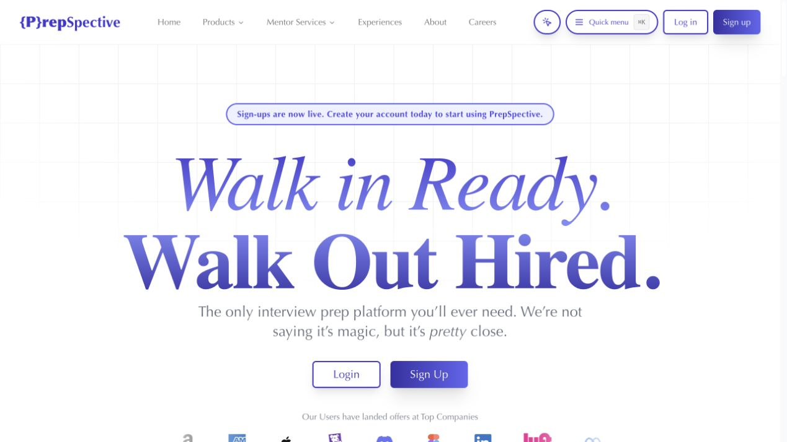
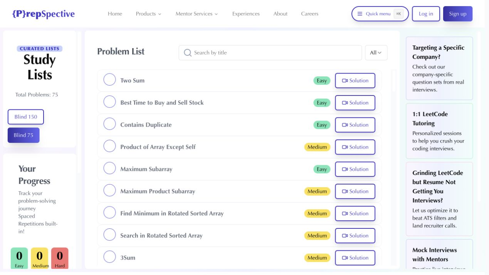
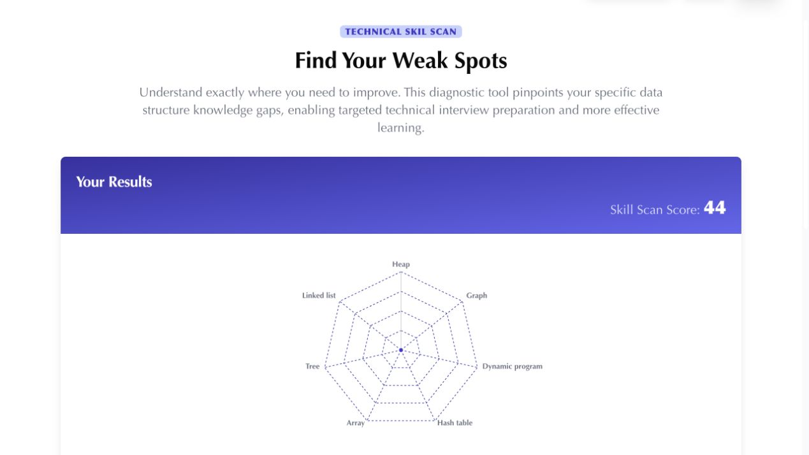
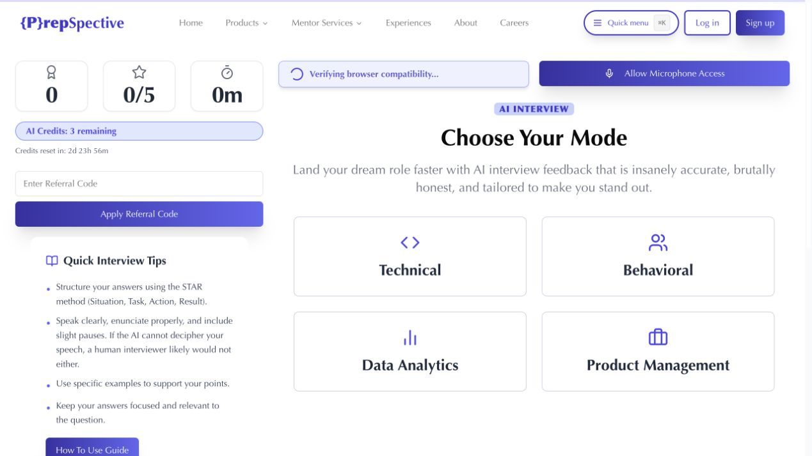
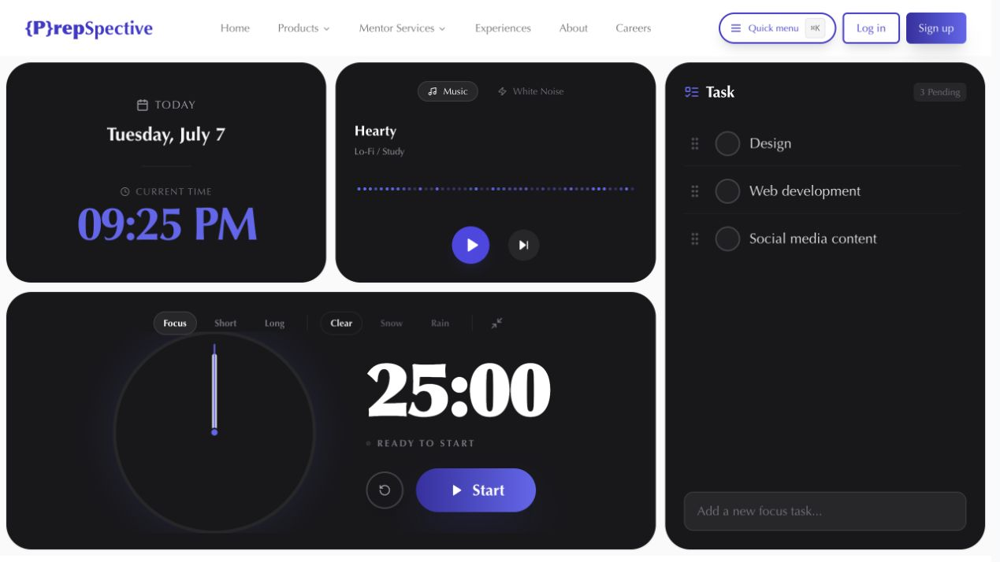

# PrepSpective

PrepSpective is an interview preparation platform built around focused practice, measurable progress, and real candidate experiences.

[View the live product](https://prepspective.vercel.app)



## Product Overview

PrepSpective brings interview research, technical practice, diagnostics, and productivity tools into one workspace.

The platform supports the full preparation cycle: learn from real interviews, identify weak areas, practice targeted questions, and maintain a consistent study routine.

## Interview Experience Explorer

Candidates can browse community-submitted interview experiences and filter by company, level, outcome, question type, and interview round. Each card includes the company logo, role, date, and relevant metadata.

Selecting a card opens the complete experience without leaving the page. The detail panel includes ratings, interview rounds, questions, coding links, and the final outcome.


## Interview Experience Submission

The submission workflow captures structured information that is useful to future candidates. Contributors can record the role, interview date, level, offer outcome, overall experience, questions, ratings, and individual rounds.


## LeetCode Study Lists

Curated Blind 75 and Blind 150 lists provide a focused technical interview roadmap. The workspace includes search, difficulty filtering, completion tracking, spaced-repetition reminders, direct problem links, and video solutions.



## Technical Skill Scan

Skill Scan runs a structured data-structures diagnostic and summarizes performance by topic. The results view combines a radar chart with topic-level recommendations so candidates can prioritize the areas that need the most work.



## AI Interview Practice

The interview simulator supports technical, behavioral, data analytics, and product management practice. It includes browser and microphone checks, session statistics, response guidance, interview history, and structured feedback.



## Focus Workspace

The built-in focus workspace combines a Pomodoro timer, task planning, music, white noise, and ambient effects. It keeps preparation sessions organized without requiring a separate productivity tool.



## Keyboard Navigation

The global quick menu opens with `Command K` on macOS or `Ctrl K` on Windows and Linux. It provides direct access to interview experiences, submissions, study lists, account actions, and supporting pages.


## Engineering Highlights

- Responsive application architecture with Next.js, React, and TypeScript.
- Reusable component system built with Tailwind CSS and Radix UI.
- Authentication and account management through Clerk.
- Relational interview data modeled with Drizzle ORM and Turso.
- Server-side API routes for interviews, questions, ratings, rounds, progress, and feedback.
- Multi-dimensional client-side filtering with combinable chips.
- Speech-recognition workflow for recorded interview responses.
- Data visualization for diagnostic results and progress reporting.
- Keyboard-accessible navigation and responsive mobile layouts.

## Technology

| Area | Technologies |
| --- | --- |
| Application | Next.js, React, TypeScript |
| Interface | Tailwind CSS, Radix UI, Framer Motion, Lucide |
| Data | Turso, libSQL, Drizzle ORM |
| Authentication | Clerk |
| Interview feedback | Model-backed feedback service, Web Speech API |
| Visualization | Recharts |
| Deployment | Vercel |

## Run Locally

Install dependencies:

```bash
npm install
```

Create an `.env` file with the required Clerk, Turso, and interview feedback credentials.

Start the development server:

```bash
npm run dev
```

Open [http://localhost:3000](http://localhost:3000).
