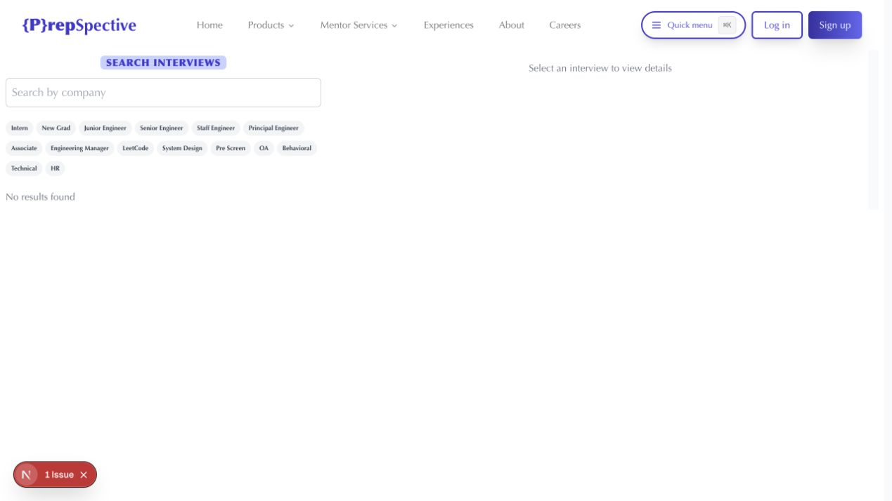
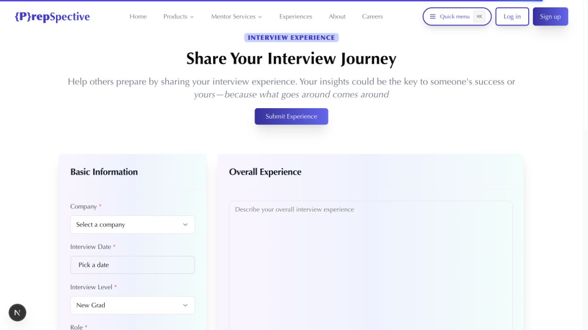
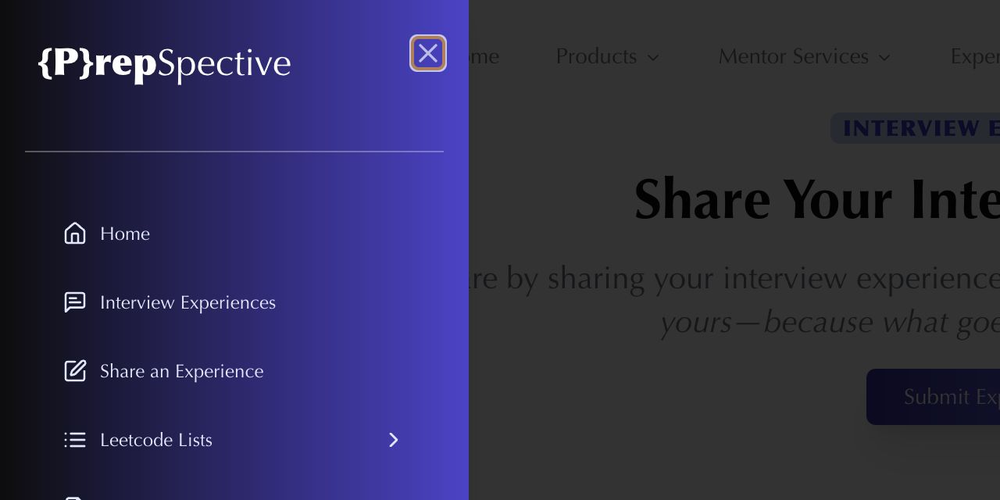

# PrepSpective

An interview preparation platform built around real candidate experiences.

## Highlights

- Browse real interview experiences.
- Search by company.
- Filter by level and interview type.
- Share complete interview journeys.
- Record questions, rounds, ratings, and outcomes.
- Open quick navigation with `⌘ K` or `Ctrl K`.
- Practice interviews and get structured feedback.
- Follow curated LeetCode lists.
- Track wins with a brag sheet.
- Stay focused with a built-in Pomodoro timer.

## Interview Explorer

Search by company. Combine chips to narrow the results.



## Share Your Journey

Record the role, rounds, questions, ratings, and outcome.



## Quick Navigation

Press `⌘ K` or `Ctrl K` from any page.



## Run Locally

```bash
npm install
npm run dev
```

Add the required Clerk, Turso, and OpenAI environment variables.

Open [http://localhost:3000](http://localhost:3000).

## Stack

Next.js. React. TypeScript. Tailwind CSS. Clerk. Drizzle. Turso.
